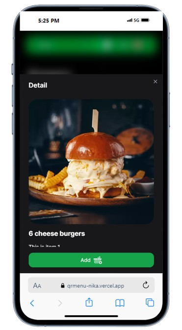
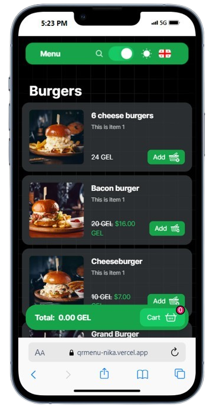

# qrMenu - Your Interactive Restaurant Menu

qrMenu is a modern web application developed using Next.js with React framework, offering an interactive dining experience. Built on top of ASP.NET Web API, qrMenu simplifies the process of browsing menus, placing orders, and customizing dishes. With seamless integration of QR code technology, users can access the menu instantly by scanning a QR code placed on the dining table.

## Table of Contents

- [Introduction](#introduction)
- [Features](#features)
- [Installation](#installation)
- [Usage](#usage)
- [Authentication and Authorization](#authentication-and-authorization)
- [API - qrMenuAPI](#qrmenuapi)
- [Contributing](#contributing)

## Introduction

Welcome to qrMenu, an innovative solution designed to revolutionize the dining experience. Leveraging the power of Next.js with React framework for frontend development and ASP.NET Web API for backend functionality, qrMenu offers a seamless platform for customers to explore menus, customize orders, and enjoy a personalized dining experience.

## Features

- Instant access to the restaurant menu by scanning a QR code.
- Browse through menu categories and items.
- Add items to the cart with customizable modifiers and ingredients.
- Place orders directly from the web application.
- Role-based authentication for staff and administrators.

## Installation

Get started with qrMenu by setting up the project locally. Follow these simple steps:

1. Clone this repository to your local machine.
2. Navigate to the project directory.
3. Install dependencies using your package manager (`npm install` or `yarn install`).
4. Start the development server (`npm run dev` or `yarn dev`).

## Usage

Discover how qrMenu enhances the dining experience:

1. Scan the QR code placed on your dining table to access the menu instantly.
2. Browse through menu categories and items.
3. Customize your order with modifiers and additional ingredients.
4. Add items to your cart and proceed to checkout.
5. Place your order directly from the web application.

## Authentication and Authorization

qrMenu implements a robust authentication system to ensure secure access for users, staff, and administrators. Role-based authorization controls access to various features and functionalities, maintaining the integrity and security of the platform.

## API - qrMenuAPI

Refer to the [qrMenuAPI Documentation](https://github.com/yourusername/qrMenuAPI) for detailed information on the endpoints provided by the qrMenuAPI. The API facilitates functionalities such as managing menus, processing orders, and handling user authentication.

## Screenshots

### Main Menu View

### Product Detail View

### Shopping Cart

## Contributing

We welcome contributions from the community to enhance the qrMenu project. To contribute:

1. Set up your development environment by following the guidelines in the [CONTRIBUTING.md](CONTRIBUTING.md) file.
2. Fork this repository and create a new branch for your contribution.
3. Make your changes, ensuring adherence to coding standards and guidelines.
4. Submit a pull request, providing a clear description of your changes and their purpose.

Feel free to customize and expand the sections as needed to accurately reflect your qrMenu project. Replace placeholders like `path/to/qrMenuBanner.png`, `path/to/mainMenuView.png`, `path/to/productDetailView.png`, and `path/to/shoppingCart.png` with the actual paths to your images and tailor the content to your project's specifics. Best of luck with your qrMenu project!
